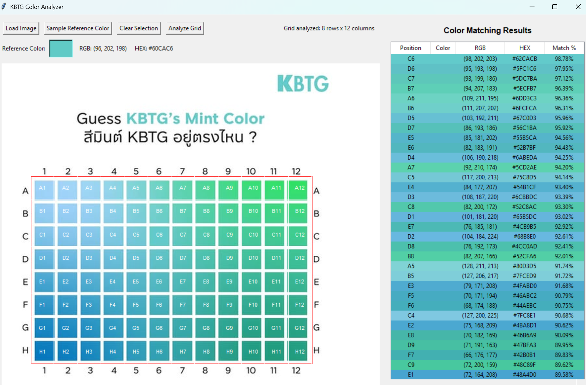

# KBTG-AnalyzeLogoColor




## Overview

The KBTG Color Analyzer allows you to:
- Load an image containing a color grid
- Select a reference color from the image (e.g., a logo color)
- Draw a selection rectangle around a color grid
- Analyze the grid to find which cells most closely match your reference color
- View results sorted by match percentage

Perfect for finding which color in a grid best matches your brand color!

## Installation Requirements

1. Make sure you have Python installed (3.6 or newer)
2. Install required libraries:
```
pip install pillow numpy
```
Or if using Anaconda:
```
conda install pillow numpy
```

## Quick Start

1. Download the `KBTG_AnalyzeColor.py` file
2. Run it using Python:
```
python KBTG_AnalyzeColor.py
```

## Step-by-Step Usage Guide

### 1. Load Your Image
- Click the "Load Image" button
- Select your color grid image (supports JPG, PNG, BMP, and GIF formats)
- The image will appear in the main canvas area

### 2. Select Reference Color
- Click the "Sample Reference Color" button
- Click on any part of the image to sample that color (e.g., click on a logo to get its exact color)
- The sampled color will appear in the reference color display with its RGB and HEX values

### 3. Select the Grid Area
- Click and drag on the image to draw a rectangle around the color grid
- Make sure your selection includes all the cells you want to analyze
- A red rectangle will indicate your selection

### 4. Analyze the Grid
- Click the "Analyze Grid" button
- Enter the number of rows and columns in your grid:
  - For a standard A1-H12 grid, use 8 rows and 12 columns
  - For other grids, adjust accordingly
- Click "OK" to begin the analysis

### 5. View Results
- Results appear in the right panel, sorted by match percentage (highest to lowest)
- Each result shows:
  - Position (e.g., A5, B7)
  - Color swatch
  - RGB values
  - HEX code
  - Match percentage to reference color
- Click on any result to highlight the corresponding cell in the grid

### 6. Clear and Restart
- Use the "Clear Selection" button to clear the current selection and results
- You can then start over with a new selection or analyze a different part of the image

## How It Works

The application calculates color similarity using RGB Euclidean distance. This provides a percentage match between the reference color and each cell in the grid. The higher the percentage, the closer the match.

## Troubleshooting

If you encounter issues:

- **Image loading errors**: Make sure your image is in a supported format (JPG, PNG, BMP, GIF)
- **Color sampling issues**: Try clicking in a different area of the color you want to sample
- **Grid analysis problems**: Ensure your rectangle selection fully encompasses the grid
- **Display issues**: Try resizing the window if the image doesn't fit properly

